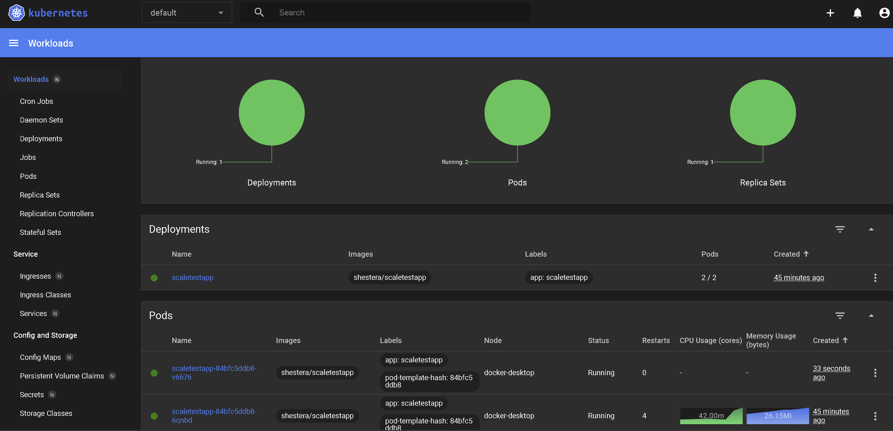
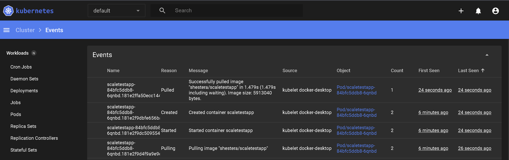

## Установка и настройка окружения

Убедиться, что установлен pip:

```bash
python -m ensurepip --upgrade
```

Установить virtualenv:

```bash
pip install virtualenv
```

Создать виртуальное окружение:

```bash
python -m venv local
```

Активировать виртуальное окружение:

```bash
source local/Scripts/activate
```

Установить фреймворк для тестирования:

```bash
pip install locust
```

Установка metrics-server на основе репозитория https://github.com/kubernetes-sigs/metrics-server:

```bash
kubectl apply -f metrics-server.yaml
```

Получаем дашборд для K8S и пробрасываем порт:

```bash
# Add kubernetes-dashboard repository
helm repo add kubernetes-dashboard https://kubernetes.github.io/dashboard/
# Deploy a Helm Release named "kubernetes-dashboard" using the kubernetes-dashboard chart
helm upgrade --install kubernetes-dashboard kubernetes-dashboard/kubernetes-dashboard --create-namespace --namespace kubernetes-dashboard
```

Создаем сервисный аккаунт и получаем токен доступа:

```bash
kubectl apply -f dashboard-service-account.yaml
kubectl apply -f dashboard-role.yaml
kubectl -n kubernetes-dashboard create token admin-user
```

Применяем конфиги деплоя, сервиса и динамического горизонтального масштабирования:

```bash
kubectl apply -f deploy.yaml
kubectl apply -f service.yaml
kubectl apply -f hpa.yaml
```

## Запуск

Пробрасываем порт для тестируемого приложения:

```bash
kubectl port-forward svc/scaletestapp-service 8080:8080
```

Пробрасываем порт для дашборда кластера `Kubernetes`:

```bash
kubectl -n kubernetes-dashboard port-forward svc/kubernetes-dashboard-kong-proxy 8443:443
```

Проверяем живучесть сервисов:

```bash
kubectl get apiservices
```

Запуск сервиса нагрузочного тестирования:

```bash
locust
```

## Результаты

Результат повышения кол-ва подов:



События:


